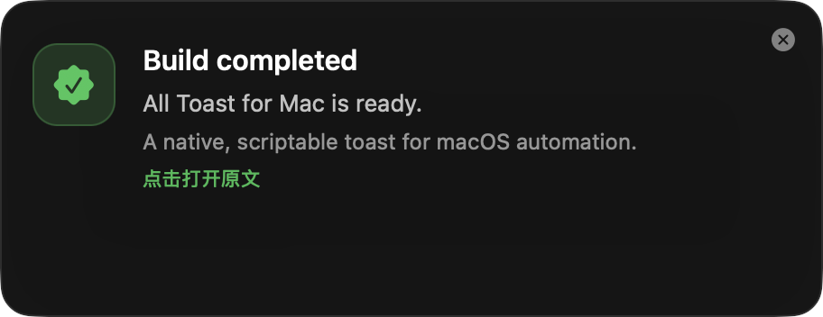
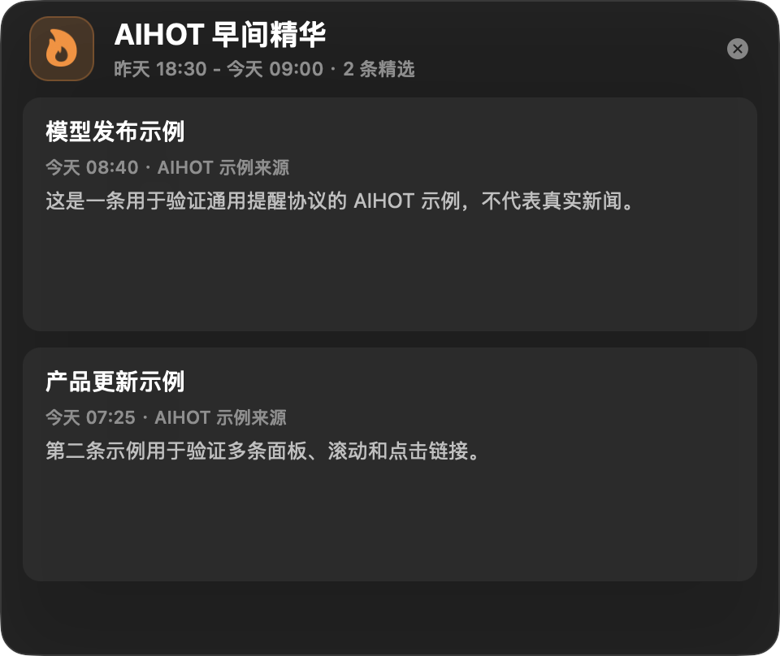
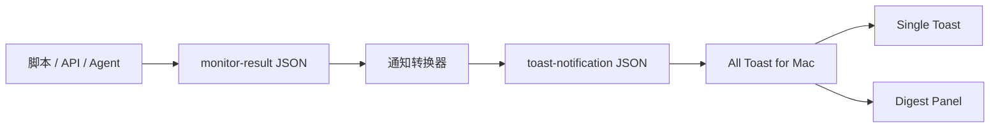

# All Toast for Mac

<p align="center">
  <strong>Native, scriptable toast notifications and digest panels for macOS.</strong><br>
  用一份 JSON，把脚本、自动化和本地 Agent 的结果变成可点击的原生 macOS 浮窗。
</p>

<p align="center">
  
  
  
  <a href="LICENSE"></a>
</p>

<table>
  <tr>
    <td width="50%"></td>
    <td width="50%"></td>
  </tr>
  <tr>
    <td align="center"><strong>Single Toast</strong><br>适合构建结果、重要变化和即时提醒</td>
    <td align="center"><strong>Digest Panel</strong><br>适合日报、监控摘要和多条信息</td>
  </tr>
</table>

All Toast for Mac 是一个轻量的 Swift + AppKit 展示层。它不负责搜索新闻、监控网站或判断业务规则，只负责接收标准数据并显示为好看、可点击、可自动关闭的本地提醒。

> 当前版本为源码构建版，尚未提供签名、Notarization、Homebrew 安装或预编译 Release。

## 为什么需要它

自动化任务经常已经能够完成“查找、判断、汇总”，但最后只能把结果写进日志或终端。All Toast for Mac 把展示层单独抽出来：



这意味着你可以替换数据源、筛选规则或调度方式，而不用重新写一套 macOS UI。

## 功能

- 原生 AppKit 界面，不依赖 Electron。
- 右下角单条 Toast，支持标题、摘要、详情和链接。
- 右侧 Digest 面板，支持多条卡片、来源、时间和核实状态。
- 点击 Toast 或卡片打开目标 URL。
- SF Symbols、自定义图片和系统主题色。
- 系统提示音、静音、自动关闭和常驻模式。
- JSON 文件或 stdin 管道输入。
- 监控结果与通知展示使用两个独立 Schema。
- 不申请 Accessibility、Screen Recording 或 Automation 权限。
- 自带 AIHOT 公开数据适配器，作为真实管道示例。

## 30 秒开始

### 1. 构建 App

要求：macOS 12+、Xcode Command Line Tools、Swift 5.8+、Python 3.10+。

```bash
git clone https://github.com/tootony0824/all-toast-for-mac.git
cd all-toast-for-mac
./renderer/build-app.sh
```

构建产物：

```text
renderer/dist/All Toast for Mac.app
```

### 2. 显示第一条 Toast

```bash
"renderer/dist/All Toast for Mac.app/Contents/MacOS/all-toast-for-mac" \
  --title "Build completed" \
  --message "All Toast for Mac is ready." \
  --detail "Click to open the project page." \
  --url "https://github.com/tootony0824/all-toast-for-mac" \
  --symbol "checkmark.seal.fill" \
  --accent "systemGreen" \
  --duration 10 \
  --sound Glass
```

### 3. 验证多条面板

```bash
python3 scripts/all-toast.py \
  --input examples/aihot-digest.json \
  --dry-run
```

去掉 `--dry-run` 即可显示真实 Digest 面板。

## JSON-first API

推荐让调用方生成标准 JSON，再通过 `scripts/all-toast.py` 校验和展示。这样业务脚本不需要了解 Swift CLI 参数。

### Single Toast

```json
{
  "schemaVersion": 1,
  "kind": "single",
  "title": "构建完成",
  "message": "新的构建产物已经生成。",
  "detail": "点击打开项目主页。",
  "url": "https://github.com/tootony0824/all-toast-for-mac",
  "duration": 10,
  "sound": "Glass",
  "theme": {
    "symbol": "checkmark.seal.fill",
    "accent": "systemGreen"
  }
}
```

```bash
python3 scripts/all-toast.py --input examples/single-toast.json
```

### Digest Panel

```json
{
  "schemaVersion": 1,
  "kind": "digest",
  "title": "每日情报",
  "subtitle": "最近 24 小时 · 1 条",
  "sticky": true,
  "theme": {
    "symbol": "newspaper.fill",
    "accent": "systemBlue"
  },
  "items": [
    {
      "id": "item-1",
      "title": "第一条更新",
      "time": "今天 09:12",
      "summary": "说明发生了什么，以及用户是否需要行动。",
      "source": "Official Source",
      "verification": "verified",
      "url": "https://example.com"
    }
  ]
}
```

完整字段见 [`toast-notification.schema.json`](schemas/toast-notification.schema.json)。

## AIHOT 管道示例

仓库内的 AIHOT 适配器只演示如何把公开数据转换成通用协议。AIHOT 的定时、去重和早间精华等完整业务逻辑由独立项目维护，不属于 All Toast 核心。

```bash
python3 scripts/aihot-selected.py --since-hours 24 --take 10 \
  | python3 scripts/monitor-to-notification.py \
      --input - \
      --title "AIHOT 最近 24 小时精选" \
      --symbol flame.fill \
      --accent systemOrange \
  | python3 scripts/all-toast.py --input - --dry-run
```

去掉最后的 `--dry-run` 即可显示面板。

## 项目地图

GitHub 目录名只能说明“它叫什么”，下面这张表说明“它负责什么”：

| 路径 | 职责 | 适合谁阅读 |
| --- | --- | --- |
| [`renderer/`](renderer/README.md) | Swift + AppKit 原生窗口、单条 Toast、Digest 和 App 构建 | 想修改 UI 或构建 App 的开发者 |
| [`schemas/`](schemas/README.md) | `monitor-result` 与 `toast-notification` JSON Schema | 要接入新数据源的开发者 |
| [`scripts/`](scripts/README.md) | JSON 校验、协议转换、AIHOT 示例适配器 | 自动化和 CLI 调用方 |
| [`examples/`](examples/README.md) | 可直接验证的通知数据 | 第一次运行项目的人 |
| [`templates/`](templates/README.md) | 本地自动化提示词模板 | 接入 Codex 自动化的人 |
| [`docs/`](docs/README.md) | 架构、数据管道和集成指南 | 需要理解设计边界的人 |
| [`assets/`](assets/) | README 使用的真实界面截图 | 项目展示与文档维护者 |

## 文档

- [架构与职责边界](docs/architecture.md)
- [数据获取、标准化与通知管道](docs/data-pipeline.md)
- [新监控接入指南](docs/integration-guide.md)
- [通知 JSON Schema](schemas/toast-notification.schema.json)
- [监控结果 JSON Schema](schemas/monitor-result.schema.json)

## 自定义渲染器路径

`scripts/all-toast.py` 默认调用仓库内构建的 App，也可以通过环境变量覆盖：

```bash
export ALL_TOAST_RENDERER="/absolute/path/to/all-toast-for-mac"
```

旧的 `INFO_TOAST_RENDERER` 变量暂时保留兼容，新的集成应使用 `ALL_TOAST_RENDERER`。

## 项目边界

All Toast for Mac 负责“怎么展示”，调用方负责“何时提醒、提醒什么”。

- 不负责网站采集、账号登录或浏览器自动化。
- 不负责领域关键词、业务相关度或事实核实。
- 不保存调用方的 token、cookie、密码或运行状态。
- 不绕过验证码、访问控制或平台限制。
- 不向邮件、飞书、Slack 等外部服务发送消息。
- 私人适配器、关键词、状态文件和本机路径不应提交到本仓库。

## 当前限制

- 目前需要从源码构建，没有预编译 Release。
- App 尚未使用 Developer ID 签名，也没有完成 Notarization。
- 当前是一次性进程模型，不是常驻菜单栏应用。
- 只提供 macOS 自绘浮窗，不替代系统通知中心。
- 多屏幕环境默认使用鼠标所在屏幕。

## 开发与贡献

修改前请先阅读 [CONTRIBUTING.md](CONTRIBUTING.md)。至少完成以下检查：

```bash
./renderer/build-app.sh
bash -n renderer/build-app.sh
python3 -m py_compile scripts/*.py
python3 scripts/all-toast.py --input examples/aihot-digest.json --dry-run
plutil -lint "renderer/dist/All Toast for Mac.app/Contents/Info.plist"
```

## License

[MIT](LICENSE)
